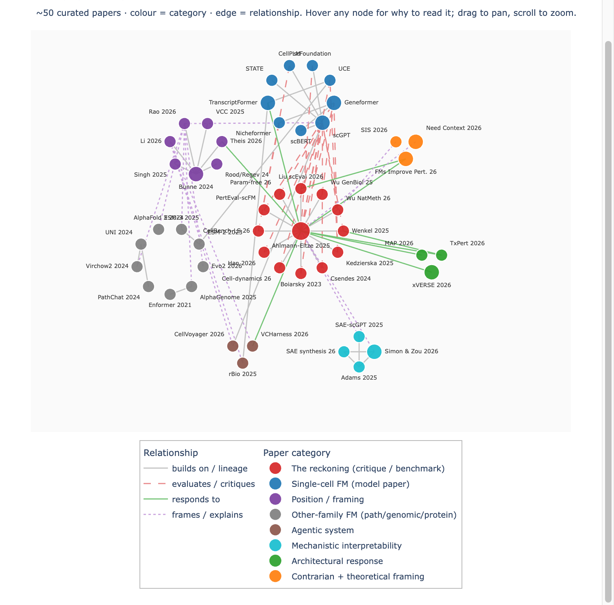

# papermap

**Interactive relationship maps for a body of literature.**

Give `papermap` a corpus of papers — the categories they fall into and the
typed relationships between them — and it renders a self-contained, interactive
HTML network with a deliberate **clustered-ring layout**: one category at the
hub, the rest ringed around it, so the structural argument of a field is
legible at a glance.

It is *not* a general graph-viz library and it is not a citation scraper. It is
an opinionated tool for one job: turning a curated reading list into a map you
can actually navigate and hand to someone else.



*The worked example — ~50 papers from a talk on foundation models for biology.
Colour is the kind of paper; edge colour is the relationship. The critique
cluster sits at the hub because every response, benchmark, and theory points
back at it.*

## Install

```bash
pip install git+https://github.com/LiudengZhang/papermap.git
# or, from a clone:
pip install -e .
```

Requires Python 3.10+. Dependencies: `plotly`, `pyyaml`.

## Use

```bash
# render a corpus to an interactive HTML file
papermap build examples/fm-to-virtual-cells.yaml -o map.html

# validate a corpus without rendering
papermap check examples/fm-to-virtual-cells.yaml
```

Or from Python:

```python
from papermap import load_corpus, build_figure, write_html

corpus = load_corpus("examples/fm-to-virtual-cells.yaml")
fig = build_figure(corpus)          # a plotly.graph_objects.Figure
write_html(fig, "map.html")
```

The output is one HTML file with `plotly.js` loaded from a CDN — open it
directly, or embed it in a site with an `<iframe>`.

## The corpus format

A corpus is a single YAML file with four required sections and one optional
one. See [`examples/fm-to-virtual-cells.yaml`](examples/fm-to-virtual-cells.yaml)
for a complete, commented example.

### `categories` — node colours

Every paper belongs to exactly one category; the category sets its colour. The
**order matters**: it is the order clusters are placed around the ring.

```yaml
categories:
  - {id: reckoning, label: "The reckoning", color: "#d62728"}
  - {id: scfm,      label: "Model papers",  color: "#1f77b4"}
```

### `relations` — edge styles

Every edge has a relation type, which sets the edge's colour and dash.
`dash` is any Plotly dash value (`solid`, `dot`, `dash`, `longdash`, ...).

```yaml
relations:
  - {id: builds_on, label: "builds on / lineage", color: "#c2c2c2", dash: solid}
  - {id: evaluates, label: "evaluates / critiques", color: "#e8888a", dash: dash}
```

### `papers` — the nodes

```yaml
papers:
  - id: ahlmann               # unique
    category: reckoning       # must match a category id
    label: "Ahlmann-Eltze 2025"   # shown on the graph
    title: "Deep-learning predictions don't generalize"  # hover line 1
    meta: "Nature Methods · 2025"                        # hover line 2
    why: "THE canonical critique paper — start here."    # hover line 3
    weight: 3                 # optional, >=1, scales the marker (default 1)
```

### `edges` — the links

Each edge is `[source, target, relation]`, read as "source *relation* target".

```yaml
edges:
  - [kedzierska, ahlmann, builds_on]
  - [ahlmann, scgpt, evaluates]
```

### `layout` — optional placement tuning

```yaml
layout:
  hub_category: reckoning   # this category goes in the centre
  hub_node: ahlmann         # optional: centred within the hub cluster
  ring_radius: 12.0         # distance from origin to each ring cluster
  hub_ring_radius: 3.8      # radius of the hub cluster's inner ring
  cluster_radius_scale: 0.34  # ring-cluster radius = scale * (node count), clamped
  cluster_radius_min: 0.95
  cluster_radius_max: 3.0
```

If `hub_category` is omitted, all categories are placed on the ring.

## How the layout works

- The **hub category** is placed at the origin. If a **hub node** is named, it
  sits dead-centre with the rest of its category ringed around it; otherwise the
  whole hub category is a normal cluster at the origin.
- Every other category is a circle of nodes, evenly spaced, at `ring_radius`
  from the origin — in the order the categories are declared.
- A ring cluster's own radius scales with how many papers it holds, clamped to
  `[cluster_radius_min, cluster_radius_max]`.
- Node labels are anchored by octant so text fans *outward* from each cluster.

The layout is fully deterministic — the same corpus always produces the same
map. There is no force-directed step, by design: a hand-arranged ring keeps the
field's structure readable instead of collapsing into a hairball.

## Validation

`papermap check` (and `load_corpus`) reject a corpus that:

- has no categories, relations, or papers;
- has duplicate category / relation / paper ids;
- has a paper in an unknown category;
- has an edge referencing an unknown paper or relation;
- names a `hub_category` / `hub_node` that doesn't exist (or a `hub_node`
  that isn't in `hub_category`).

## Development

```bash
pip install -e ".[dev]"
pytest
```

## License

MIT — see [LICENSE](LICENSE).
